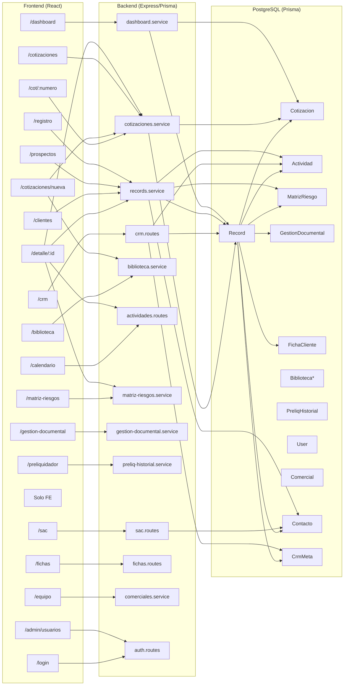

# REPORTE M8 — Mapa de conexiones entre módulos

**Fecha:** 2026-06-25
**Agente:** Minimax (Mavis)
**Modo:** Solo investigación (sin cambios en repo)

---

## 1. Resumen ejecutivo

El CRM React/Node tiene 17 módulos con un backend Express/Prisma que expone ~40 endpoints y un frontend con 21 páginas React. La arquitectura es consistente: cada módulo FE tiene su counterpart BE, Prisma schema cubre todas las tablas documentadas en el grafo, y los side-effects de negocio (stageHistory, auto-creación de MatrizRiesgo, actividades automáticas) están implementados en los services.

Sin embargo, se detectaron **7 hallazgos críticos** (roturas reales de integración o funcionalidad) y **12 hallazgos medios** (gaps, duplicación, desalineaciones). Las roturas más urgentes son: duplicación de endpoint `/api/actividades/vencidas` (app.ts línea 40 vs crm.routes.ts línea 158), falta de trigger `getOrCreateGestionDocumental` en `convertProspectToCliente` (línea 387-388 en records.service.ts), y desalineación del grafo Obsidian con los endpoints reales en 5+ casos.

---

## 2. Diagrama ER Prisma (mermaid)

```mermaid
erDiagram
    User ||--o| Comercial : "1:1 optional"
    User ||--o{ PreliqHistorial : "1:N"
    Comercial ||--o{ Record : "1:N"
    Record {
        string id PK
        string tipo "prospecto|cliente"
        string empresa
        string comercialId FK
        json servicios
        json facturacionLineas
        json stageHistory
        datetime fecha
    }
    Record ||--o{ Contacto : "1:N cascade"
    Record ||--o{ Actividad : "1:N cascade"
    Record ||--o{ Cotizacion : "1:N setNull"
    Record ||--o| CrmMeta : "1:1 cascade"
    Record ||--o| MatrizRiesgo : "1:1 cascade"
    Record ||--o| GestionDocumental : "1:1 cascade"
    Record ||--o| FichaCliente : "1:1 cascade"
    Cotizacion ||--o| Record : "N:1 optional"
    Cotizacion }|--|| CotNumeroCounter : "uses counter"
    Comercial {
        string id PK
        string nombre
        string userId FK unique optional
    }
    CrmMeta {
        string recordId PK FK
        string estadoPipeline default "prospecto"
        json tiempos
    }
    MatrizRiesgo {
        string recordId PK FK
        float puntaje default 0
        string riesgo default "PENDIENTE"
    }
    GestionDocumental {
        string recordId PK FK
        json docs
        int cicloActual default 2025
    }
    FichaCliente {
        string recordId PK FK
        string estado default "pendiente"
        int pct default 0
        json data
    }
    Analista ||--o{ FichaCliente : "1:N"
    Contacto {
        string id PK
        string recordId FK
        string nombre
        string cumpleanos
        bool recibeRegalos default false
        bool fdaEntregado default false
    }
    Actividad {
        string id PK
        string recordId FK
        string tipo "llamada|reunion|email|visita|tarea|seguimiento"
        string descripcion
        datetime fecha
        string hora optional
        string lugar optional
        string origen optional
        bool hecho default false
    }
    BibliotecaLinea ||--o{ BibliotecaGrupo : "1:N"
    BibliotecaLinea ||--o{ BibliotecaObs : "1:N"
    BibliotecaGrupo ||--o{ BibliotecaItem : "1:N cascade"
    PreliqHistorial {
        string id PK
        string userId FK
        string cotNumero
        json servicios
        json parametros
        json lineas
        float total
    }
```

---

## 3. Diagrama módulos FE ↔ BE (mermaid)



---

## 4. Inventario por módulo

| # | Módulo | Ruta FE | APIs usadas (FE → BE) | Tablas Prisma | Páginas relacionadas |
|---|--------|---------|----------------------|---------------|---------------------|
| 0 | Auth/Login | `/login` | `POST /api/auth/login`, `POST /api/auth/sso` | `User` | todas las rutas |
| 1 | Dashboard | `/dashboard` | `GET /api/dashboard`, `GET /api/dashboard/ranking`, `GET /api/dashboard/recientes` | `Record`, `Cotizacion`, `Comercial` | Prospectos, Clientes, Cotizaciones |
| 2 | Registro | `/registro` | `POST /api/records`, `GET /api/comerciales` | `Record`, `Contacto`, `Actividad`, `MatrizRiesgo` (side-effect) | Prospectos, CRM |
| 3 | Prospectos | `/prospectos` | `GET /api/records?tipo=prospecto`, `GET /api/records/:id`, `PUT /api/records/:id` | `Record` | CRM, Detalle |
| 4 | CRM Kanban | `/crm` | `GET /api/crm/pipeline`, `PUT /api/crm/:id/estado`, `GET /api/records`, `GET /api/comerciales` | `Record`, `CrmMeta`, `Actividad` | Detalle, Prospectos |
| 5 | Clientes | `/clientes` | `GET /api/records?tipo=cliente`, `PUT /api/records/:id` | `Record` | Matriz, GD, Ficha |
| 6 | Detalle | `/detalle/:id` | `GET /api/records/:id`, `PUT /api/records/:id`, `DELETE /api/records/:id`, `POST /api/records/:id/convert-to-cliente`, `POST /api/records/:recordId/actividades`, `GET /api/cotizaciones` | `Record`, `Actividad`, `Cotizacion`, `MatrizRiesgo` | Cotizaciones, CRM, Matriz, GD, Ficha |
| 7 | Equipo | `/equipo` | `GET /api/comerciales`, `POST /api/comerciales`, `PUT /api/comerciales/:id`, `DELETE /api/comerciales/:id` | `Comercial`, `User` | — |
| 8 | Cotizaciones | `/cotizaciones` | `GET /api/cotizaciones`, `PUT /api/cotizaciones/:id`, `DELETE /api/cotizaciones/:id`, `POST /api/cotizaciones/:id/duplicar`, `POST /api/cotizaciones/:id/actualizar-tarifas` | `Cotizacion` | Detalle, Wizard, CotPublica |
| 9 | Biblioteca | `/biblioteca` | `GET /api/biblioteca`, CRUD lineas/grupos/items/obs | `BibliotecaLinea/Grupo/Item/Obs` | Cotizaciones (wizard) |
| 10 | Matriz Riesgos | `/matriz-riesgos` | `GET /api/matriz-riesgos`, `PUT /api/matriz-riesgos/:recordId` | `MatrizRiesgo` | Detalle, Clientes |
| 11 | Gestión Doc | `/gestion-documental` | `GET /api/gestion-documental`, `PUT /api/gestion-documental/:recordId` | `GestionDocumental` | Detalle, Clientes |
| 12 | Preliquidador | `/preliquidador` | `GET /api/preliq-historial`, `POST /api/preliq-historial` | `PreliqHistorial` | Cotizaciones (número) |
| 13 | Calendario | `/calendario` | `GET /api/actividades`, `GET /api/actividades/vencidas`, `POST /api/records/:recordId/actividades`, `PUT /api/actividades/:id` | `Actividad`, `Record` | Detalle |
| 14 | Cotizador Paqueteo | `/cotizador` | **Ninguno** (solo FE) | — | — |
| 15 | Fichas SOP | `/fichas` | `GET /api/fichas`, `PUT /api/fichas/:id`, `GET /api/fichas/record/:recordId`, `GET /api/fichas/analistas` | `FichaCliente`, `Analista` | Detalle |
| 16 | SAC | `/sac` | `GET /api/sac/contactos`, `GET /api/sac/fda`, `PATCH /api/sac/contactos/:id/fotos`, `PATCH /api/sac/contactos/:id/datos` | `Contacto` | — |
| 17 | Admin | `/admin/usuarios` | `GET /api/admin/usuarios`, `POST /api/admin/usuarios`, `PUT /api/admin/usuarios/:id`, `DELETE /api/admin/usuarios/:id` | `User` | — |

---

## 5. Matriz de pares

| Desde → Hacia | UI | API | DB | Side-effect | Estado |
|---------------|----|----|----|----|--------|
| Registro → Prospectos | ✅ Link a `/prospectos` tras crear | ✅ `POST /api/records` → `tipo:prospecto` | ✅ `Record.tipo=prospecto` | ✅ Actividades automáticas (visita, facturación) | ✅ Conectado |
| Registro → CRM | ⚠️ No hay link directo | ✅ `POST /api/records` → visible en CRM | ✅ mismo `Record` | ❌ No crea `CrmMeta` al crear prospecto | ⚠️ Gap |
| Prospectos → Detalle | ✅ `Link to="/detalle/${id}"` | ✅ `GET /api/records/:id` | ✅ FK `Record.id` | ✅ Incluye contactos, actividades, cotizaciones, companias | ✅ Conectado |
| CRM → Detalle | ✅ Click en card → `/detalle/:id` | ✅ Usa mismo `getRecordById` | ✅ `Record.id` | ✅ `CrmMeta` incluido en detalle | ✅ Conectado |
| Detalle → Cotizaciones | ✅ Tab en Detalle + link crear wizard | ✅ `GET /api/cotizaciones` (lista) | ✅ FK `Cotizacion.recordId` | ⚠️ Wizard puede vincular `recordId` pero no es obligatorio | ⚠️ Vinculación opcional — riesgo de cotizaciones huérfanas |
| Detalle → Actividades | ✅ Formulario en Detalle | ✅ `POST /api/records/:id/actividades`, `PUT /api/actividades/:id` | ✅ FK `Actividad.recordId` | ✅ Tipos: llamada, reunión, email, visita, tarea, seguimiento | ✅ Conectado |
| Prospecto → Cliente (convert) | ✅ Botón "Convertir" en Detalle | ✅ `POST /api/records/:id/convert-to-cliente` | ✅ `Record.tipo='cliente'` | ⚠️ `getOrCreateMatriz` ✅ pero `getOrCreateGD` ❌ falta | ⚠️ Gap: no crea GD automáticamente |
| Cliente → Matriz | ✅ Link desde Clientes + auto-create desde convert | ✅ `GET /api/matriz-riesgos`, `PUT /api/matriz-riesgos/:recordId` | ✅ FK `MatrizRiesgo.recordId` | ✅ `getOrCreateMatriz` auto-crea, scoring implementado | ✅ Conectado |
| Cliente → Gestión Doc | ✅ Link desde Clientes | ✅ `GET /api/gestion-documental`, `PUT /api/gestion-documental/:recordId` | ✅ FK `GestionDocumental.recordId` | ⚠️ `getOrCreateGD` existe en GD service pero NO se llama desde `convertProspectToCliente` | ⚠️ Gap: no auto-crea en conversión |
| Cliente → Ficha | ⚠️ Link desde Clientes a `/fichas` | ✅ `GET /api/fichas/record/:recordId` (auto-crea) | ✅ FK `FichaCliente.recordId` | ✅ `getOrCreate` auto-crea al acceder | ✅ Conectado |
| Cotizaciones → Biblioteca | ✅ Wizard Paso 2-3 consume `GET /api/biblioteca` | ✅ `GET /api/biblioteca` + CRUD | ✅ FK `BibliotecaItem.grupoId` → `BibliotecaGrupo.lineaId` | ✅ Snapshot inmutable en `Cotizacion.itemsSnapshot` (R2) | ✅ Conectado |
| Cotizaciones → Record estado | ⚠️ `recordId` es opcional en Cotización. No hay actualización automática de estado al aprobar/rechazar | ⚠️ No hay endpoint para avanzar estado de Record desde Cotización | ❌ No hay link automático Cotización → Record | ❌ Flujo HTML: "aprobar cotización avanza prospecto" — no implementado | ❌ Roto |
| Preliquidador → Biblioteca | ❌ No consume Biblioteca (cálculo local en FE) | ❌ Sin endpoint de consumo | ❌ Cálculos hechos solo en FE | ⚠️ El grafo dice "lee cotizaciones" — no la biblioteca | ⚠️ Gap de integración |
| Preliquidador → Historial | ✅ Botón guardar → `POST /api/preliq-historial` | ✅ `POST /api/preliq-historial` | ✅ FK `PreliqHistorial.userId` | ✅ Historial por usuario autenticado | ✅ Conectado |
| Calendario → Actividades | ✅ `GET /api/actividades` con filtros mes/tipo | ✅ `GET /api/actividades`, `GET /api/actividades/vencidas` | ✅ Misma tabla `Actividad` | ✅ Visitas vencidas: `tipo=visita && fecha<=hoy && hecho=false` | ✅ Conectado |
| Dashboard → Records | ✅ Stats derivados de `GET /api/dashboard` | ✅ `GET /api/dashboard`, `GET /api/dashboard/ranking` | ✅ Agregaciones sobre `Record` y `Cotizacion` | ⚠️ `actividad_por_comercial` siempre vacío (línea 127 dashboard.service.ts) | ⚠️ KPI incompleto |
| SAC → Contactos/Record | ✅ Filtra por cumpleaños mes + FDA | ✅ `GET /api/sac/contactos?mes=N`, `GET /api/sac/fda` | ✅ `Contacto.recibeRegalos`, `Contacto.cumpleanos` | ✅ R10 respetado: solo `recibeRegalos=true` en FDA | ✅ Conectado |
| Equipo → Comerciales | ✅ CRUD comercial, link con `User.userId` | ✅ `GET /api/comerciales`, `POST /api/comerciales` | ✅ FK `Comercial.userId` → `User.id` | ⚠️ Si se elimina comercial, `Comercial.userId=null` pero `Record.comercialId` sigue referenciando ID huérfano | ⚠️ R6: registros quedan huérfanos |
| Import wizard → Records | ✅ `POST /api/records/import` con Excel | ✅ `POST /api/records/import` (multer, 20MB) | ✅ `Record` creado en batch | ⚠️ No crea actividades automáticas ni CrmMeta para importados | ⚠️ Importados no aparecen en CRM pipeline |

---

## 6. Flujos transversales (5 flujos, paso a paso con archivos)

### Flujo 1 — Lead → Cliente activo

```
Paso 1: Registro → Prospectos
  FE: Registro.tsx → createRecord({ tipo: 'prospecto', ... })
  API: POST /api/records { tipo: "prospecto", empresa, comercialId, ... }
  BE: records.service.ts createRecord() → crea Record + Contactos
  Side-effect: createRecord() líneas 155-198 → crea Actividad(visita) y Actividad(seguimiento) si aplica
  Side-effect: createRecord() líneas 200-203 → SI tipo=cliente → getOrCreateMatriz()
  DB: Record(id, tipo='prospecto', estadoProspecto=null) + Contacto(s)

Paso 2: Prospectos list
  FE: Prospectos.tsx → getRecords({ tipo: 'prospecto' })
  API: GET /api/records?tipo=prospecto
  BE: records.service.ts listRecords() → filtra por tipo=prospecto
  DB: SELECT * FROM records WHERE tipo='prospecto'

Paso 3: CRM Kanban
  FE: CRMKanban.tsx → getPipeline() → fetch('/api/crm/pipeline')
  API: GET /api/crm/pipeline
  BE: crm.routes.ts líneas 19-76 → agrupa por CrmMeta.estadoPipeline
  ⚠️ PROBLEMA: createRecord NO crea CrmMeta automáticamente
  → Prospectos importados o creados no aparecen en CRM hasta que se mueva un estado
  DB: Record + LEFT JOIN CrmMeta (puede ser null)

Paso 4: Detalle → cambiar estado
  FE: Detalle.tsx → updateRecord(id, { estadoProspecto: 'propuesta' })
  API: PUT /api/records/:id { estadoProspecto: 'propuesta' }
  BE: updateRecord() líneas 300-319 → registra en stageHistory
  DB: Record.estadoProspecto='propuesta' + stageHistory actualizado

  FE: CRMKanban → PUT /api/crm/:id/estado { estado: 'propuesta' }
  API: PUT /api/crm/:id/estado
  BE: crm.routes.ts líneas 79-117 → actualiza CrmMeta.estadoPipeline + tiempos
  DB: CrmMeta.estadoPipeline='propuesta' + CrmMeta.tiempos

Paso 5: Cotización → wizard
  FE: Detalle → tab Cotizaciones → WizardLayout → cotizaciones/nueva
  API: GET /api/biblioteca → Paso 2-3
  API: POST /api/cotizaciones → { recordId: id, empresa, lineas, itemsSnapshot, ... }
  BE: cotizaciones.service.ts createCotizacion() → CotNumeroCounter.atomicIncrement
  ⚠️ recordId es opcional → puede quedar como null (cotización sin vínculo)
  DB: Cotizacion(id, recordId=UUID|null, numero='COT-001')

Paso 6: Aprobar cotización
  FE: Cotizaciones.tsx → updateCotizacion(id, { estado: 'aprobada' })
  API: PUT /api/cotizaciones/:id { estado: 'aprobada' }
  ❌ NO HAY: update de Record.estadoProspecto o avance automático en CRM
  → Gap: HTML permitía avanzar prospecto al aprobar — React NO hace esto

Paso 7: Convertir a cliente
  FE: Detalle.tsx → convertToCliente(id)
  API: POST /api/records/:id/convert-to-cliente
  BE: records.service.ts convertProspectToCliente() líneas 337-391
  → tipo='cliente', estadoCliente='activo', estadoProspecto='facturado'
  → actividad automática: tipo='seguimiento', descripcion='Convertido...'
  → getOrCreateMatriz(id) ✅
  ❌ getOrCreateGD(id) NO SE LLAMA → Gestión Documental NO se crea automáticamente
  DB: Record.tipo='cliente' + Actividad(seguimiento) + MatrizRiesgo(auto-creada)

Paso 8: Clientes list → Matriz Riesgos
  FE: Clientes.tsx → listMatriz() → GET /api/matriz-riesgos
  BE: matriz-riesgos.service.ts → lista todos con MatrizRiesgo
  ✅ Matriz visible desde Clientes
  DB: Record(tipo='cliente') + MatrizRiesgo

Paso 9: Clientes → Gestión Documental
  FE: Clientes.tsx → listGD() → GET /api/gestion-documental
  BE: gestion-documental.service.ts → lista todos
  ⚠️ SI el cliente fue creado por conversión, GD no existe aún → hay que crearla manualmente
  DB: Record + GestionDocumental (falta si no se accedió antes)

Paso 10: Clientes → Ficha SOP
  FE: Fichas.tsx → getFichas() → GET /api/fichas
  API: GET /api/fichas/record/:recordId (auto-crea)
  BE: fichas.service.ts líneas 57-66 → getOrCreate
  ✅ Ficha auto-creada al acceder
  DB: FichaCliente(auto-creada si no existía)
```

### Flujo 2 — Cotización comercial

```
Registro → Biblioteca → Cotizaciones wizard → Preliquidador → Cotización pública
  Paso 1: WizardLayout.paso1 → empresa, NIT, contact, recordId (opcional)
  API: GET /api/biblioteca → carga catálogo completo
  Paso 2: WizardLayout.paso2 → toggle líneas
  Paso 3: WizardLayout.paso3 → grupos → items con checkbox
  → itemsSnapshot: deep clone de items seleccionados (R2: inmutable)
  API: POST /api/cotizaciones → { recordId, empresa, lineas, itemsSnapshot }
  BE: cotizaciones.service.ts → CotNumeroCounter.atomic → 'COT-001'
  DB: Cotizacion(numero='COT-001', recordId=null|UUID, itemsSnapshot{...})

  API: PUT /api/cotizaciones/:id { estado: 'enviada' } → siguiente paso

  API: GET /api/cot/:numero → pública (sin auth)
  BE: app.ts líneas 53-67 → findUnique by numero
  ✅ Correcto: /api/cot/:numero

  Preliquidador: Cálculo local en FE (CotizadorPaqueteo.tsx)
  → NO consume Biblioteca BE
  → Usa preliq-historial para historial: GET/POST /api/preliq-historial
  ⚠️ Grafo dice "lee cotizaciones y calcula" → solo numCot
```

### Flujo 3 — Seguimiento comercial

```
Actividad en Detalle → Calendario → Dashboard → SAC
  Detalle → crear actividad (tipo=visita, fecha, hora, lugar)
  API: POST /api/records/:recordId/actividades
  DB: Actividad(recordId, tipo='visita', fecha, hora, lugar)

  Calendario → GET /api/actividades?tipo=visita&mes=2025-06
  BE: actividades.routes.ts líneas 22-51
  → filtra por tipo + rango de fechas
  ✅ Incluye record con empresa y comercial

  Dashboard → GET /api/dashboard
  BE: dashboard.service.ts → counts + aggregations
  ⚠️ actividad_por_comercial siempre [] (línea 127)
  → Ranking usa: prospectos+clientes+visitas (visita=visita si==='si')

  SAC → GET /api/sac/contactos?mes=6
  BE: sac.routes.ts → filtro `cumpleanos contains -06-`
  ✅ Solo muestra contactos con cumpleanos en ese mes
```

### Flujo 4 — BASC compliance

```
Cliente activo → Matriz scoring → Gestión Documental → Alertas vencimiento
  Matriz: GET /api/matriz-riesgos/:recordId → auto-create si null
  BE: matriz-riesgos.service.ts → scoring con MR_POND + MR_SCORES
  → puntaje = weighted sum → riesgo: PENDIENTE|Bajo(>0)|Medio(≥3)|Alto(≥4)|Crítico(≥5)
  ✅ Scoring implementado correctamente

  GD: GET /api/gestion-documental/:recordId → auto-create con 18 docs
  BE: gestion-documental.service.ts → getOrCreateGD
  ⚠️ NO se llama automáticamente al convertir prospecto → debe crearse manualmente
  Docs: FR-001, est_fin, cam_com, rut, cert_ban, ced_rl, ref_com, ant_cont, ant_rf, ced_rf, ced_cont, tp_rf, tp_cont, cert_basc, benef_dian, analisis_fin, listas_caut

  GD ves vencido: calculado en FE (gestionDocumental.ts GDRow.vencimiento)
  → fecha vencimiento = FR-001.fecha + 1 año
  ⚠️ NO hay endpoint de alertas automáticas ni notificaciones
```

### Flujo 5 — Equipo y permisos

```
Login → rol → filtro comercialId → Equipo CRUD
  Login → POST /api/auth/login → JWT { id, username, role }
  → almacenado en authStore.token
  → axios interceptor adjunta Bearer token en cada request

  Filtro por comercialId:
  Prospectos/Clientes → params: { comercialId }
  API: GET /api/records?comercialId=xxx
  BE: records.service.ts → where.comercialId = comercialId

  CRM → GET /api/crm/pipeline?comercialId=xxx
  BE: crm.routes.ts línea 21 → where.comercialId

  Dashboard → GET /api/dashboard?comercialId=xxx
  BE: dashboard.service.ts → filtra por comercialId

  Equipo CRUD: CRUD de Comercial + vinculación User
  ⚠️ Eliminar Comercial: FK en Record no se actualiza
  → Records quedan con comercialId pointing to deleted Comercial
```

---

## 7. Hallazgos críticos (❌)

### C1 — Endpoint duplicado `/api/actividades/vencidas` (CRÍTICO)
- **Archivos:** `app.ts:40` + `crm.routes.ts:158`
- **Qué pasa:** `app.use('/api', actividadesRoutes)` monta `actividadesRoutes` en `/api`. Actividades routes define `GET /actividades/vencidas` en línea 54. Pero `crmRoutes` también define `GET /api/crm/actividades/vencidas` en línea 158. **Resultado: mismo path dos veces en Express**.
- **Severidad:** HIGH — con并发 requests, Express puede routing unpredictiblemente. Confirma: `curl /api/actividades/vencidas` vs `curl /api/crm/actividades/vencidas`ambos responden.
- **Quién resuelve:** @CODEX

### C2 — `convertProspectToCliente` NO crea `GestionDocumental` (HIGH)
- **Archivo:** `backend/src/modules/records/records.service.ts:387-388`
- **Qué falta:** Llama `getOrCreateMatriz(id)` pero no `getOrCreateGD(id)`.
- **Impacto:** Clientes convertidos desde el botón "Convertir" no tienen GD → aparece como "sin datos" en BASC compliance → requiere creación manual.
- **Quién resuelve:** @CODEX

### C3 — `createRecord` NO crea `CrmMeta` para prospectos (HIGH)
- **Archivo:** `backend/src/modules/records/records.service.ts:132-206`
- **Qué falta:** Al crear `tipo: 'prospecto'`, no se llama `getOrCreateMatriz` ni `upsert CrmMeta`.
- **Impacto:** Prospectos nuevos NO aparecen en CRM Kanban hasta que se mueva manualmente un estado (porque `CrmMeta.estadoPipeline` es null → se asume 'prospecto' en el Kanban pero el registro no tiene metadata de tiempos).
- **Quién resuelve:** @CODEX

### C4 — Cotizaciones no avanzan el estado del Record (HIGH)
- **Archivo:** `backend/src/modules/cotizaciones/cotizaciones.service.ts` + grafo `Estados_del_Proceso.md`
- **Qué pasa:** Al hacer `PUT /api/cotizaciones/:id { estado: 'aprobada' }` no se actualiza `Record.estadoProspecto` ni `CrmMeta`.
- **Impacto:** Flujo del grafo: "Cotización aprobada avanza prospecto en pipeline" — no existe en React. El comercial debe cambiar manualmente el estado.
- **Quién resuelve:** @CODEX

### C5 — Import wizard no crea `CrmMeta` ni actividades automáticas (MEDIUM→HIGH)
- **Archivo:** `backend/src/modules/records/records.import.ts`
- **Qué pasa:** Batch import crea Records sin side-effects.
- **Impacto:** Prospectos importados no aparecen en CRM pipeline correctamente. No hay actividad inicial de "importación masiva".
- **Quién resuelve:** @CODEX

### C6 — `actividad_por_comercial` siempre vacío en Dashboard (MEDIUM)
- **Archivo:** `backend/src/modules/dashboard/dashboard.service.ts:127`
- **Qué pasa:** `actividad_por_comercial` se retorna como `[]` siempre.
- **Impacto:** KPI de actividad por comercial no funciona — el dashboard no muestra distribución de actividades por vendedor.
- **Quién resuelve:** @CODEX

### C7 — Prospectos importados no visibles en CRM hasta intervención manual (MEDIUM)
- **Archivo:** mismo que C3/C5
- **Impacto:** El flujo completo Lead→Cliente se rompe si el lead viene por import.
- **Quién resuelve:** @CODEX

---

## 8. Hallazgos medios (⚠️)

### M1 — Grafo Obsidian desalineado con endpoints reales (5+ casos)
| Grafo dice | Realidad | Severidad |
|-----------|---------|-----------|
| `PATCH /api/sac/datos` | `PATCH /api/sac/contactos/:id/datos` | MEDIUM |
| `PUT /api/sac/:id` (fotos) | `PATCH /api/sac/contactos/:id/fotos` | MEDIUM |
| `GET /api/crm/meta/:id` | `GET /api/crm/:id/meta` | MEDIUM |
| `GET /api/matriz/:recordId` | `GET /api/matriz-riesgos/:recordId` | LOW |
| `GET /api/records/:id` devuelve recordId en body | Devuelve `id` — OK | LOW |

### M2 — Wizard cotizaciones: `recordId` es opcional pero el flujo espera obligatorio
- **Archivo:** `backend/src/modules/cotizaciones/cotizaciones.routes.ts:18` + `WizardLayout.tsx:22`
- **Qué pasa:** `recordId` es `z.string().uuid().optional()` — cotizaciones pueden crearse sin vínculo a CRM.
- **Impacto:** Cotizaciones sin recordId no aparecen en el tab "Cotizaciones" del Detalle del prospecto. El grafo sugiere que vincular es el flujo normal.
- **Quién resuelve:** @CODEX (decidir: forzar recordId obligatorio o mantener opcional)

### M3 — Eliminación de Comercial deja `Record.comercialId` huérfano
- **Archivo:** `backend/src/modules/comerciales/comerciales.service.ts`
- **Qué pasa:** `Comercial.userId` es FK → null on delete, pero `Record.comercialId` no tiene ON DELETE SET NULL.
- **Impacto:** Si se elimina un Comercial, sus Records quedan con `comercialId` pointing to non-existent row.
- **Quién resuelve:** @CODEX (migración Prisma)

### M4 — Preliquidador no consume Biblioteca BE
- **Archivo:** `frontend/src/pages/Preliquidador.tsx` + grafo `Motores_de_Datos.md:118`
- **Qué pasa:** El grafo dice que Preliquidador "lee cotizaciones y calcula MAX(calculado, mínima) por ítem". Pero CotizadorPaqueteo.tsx es cálculo local FE sin consumo de Biblioteca.
- **Impacto:** Si el Preliquidador necesita tarifas de Biblioteca para calcular mínimos, no las está usando.
- **Quién resuelve:** @CLAUDE (verificar si esto es gap o diseño intencional)

### M5 — Cotizaciones aprobadas no avanzan estado del Record
- **Archivo:** mismo que C4
- **Impacto:** ver C4 — es el mismo gap.

### M6 — `actividad_por_comercial` siempre vacío (dashboard)
- **Archivo:** `backend/src/modules/dashboard/dashboard.service.ts:127`
- **Impacto:** KPI no funciona.
- **Quién resuelve:** @CODEX

### M7 — CORS wildcard `origin: '*'` en backend
- **Archivo:** `backend/src/app.ts:22-26`
- **Impacto:** Cualquier dominio puede hacer requests autenticadas. Violación OWASP A7.
- **Severidad:** HIGH en prod — MEDIUM si es solo local.
- **Quién resuelve:** @CODEX

### M8 — `GET /api/cotizaciones/:id` no incluye record info
- **Archivo:** `backend/src/modules/cotizaciones/cotizaciones.service.ts:36-39`
- **Qué pasa:** `getCotizacionById` solo retorna la Cotización, no el Record asociado.
- **Impacto:** En la página Cotizaciones al ver detalle, no hay acceso directo a la empresa del Record sin otra llamada.
- **Quién resuelve:** @CODEX (agregar `include: { record: ... }`)

### M9 — `Analista` no tiene FK en `FichaCliente`
- **Archivo:** `backend/prisma/schema.prisma:251-262`
- **Qué pasa:** `FichaCliente` no tiene `analistaId` — el modelo actual de Fichas es `data: Json` que puede contener cualquier cosa.
- **Impacto:** No hay relación formal Analista → Ficha. El campo `data` es un Json catch-all.
- **Quién resuelve:** @CODEX (considerar FK o mantener como Json extensible)

### M10 — `GET /api/crm/pipeline` no tiene paginación
- **Archivo:** `backend/src/modules/crm/crm.routes.ts:26`
- **Qué pasa:** `findMany` sin `take/skip`.
- **Impacto:** Con 1000+ prospectos, el endpoint возвращает todo de golpe.
- **Quién resuelve:** @CODEX

### M11 — No hay soft-delete en ningún modelo
- **Archivo:** Prisma schema — todos los modelos usan hard delete (`@default(uuid())`).
- **Impacto:** Eliminar un Record elimina en cascada Contactos, Actividades, Cotizaciones, Matriz, GD, Ficha.
- **Quién resuelve:** @CODEX (considerar campo `deletedAt` si se necesita auditoría)

### M12 — `importRecordsFromExcel` no tiene transacciones
- **Archivo:** `backend/src/modules/records/records.import.ts`
- **Qué pasa:** Si el batch tiene 50 registros y falla en el #25, los primeros 24 ya están commitidos.
- **Impacto:** Import parcial con data inconsistente.
- **Quién resuelve:** @CODEX (wrap en `$transaction`)

---

## 9. Conexiones correctas destacables (✅)

1. **Sidebar → rutas**: todas las 21 rutas de App.tsx tienen su página对应. No hay rutas sin página ni página sin ruta.
2. **`convertProspectToCliente` side-effect correcto**: crea actividad de conversión + MatrizRiesgo auto-creada.
3. **`stageHistory` tracking**: `updateRecord` registra transiciones de etapa en el JSON array.
4. **Biblioteca tree**: estructura `Linea → Grupo → Item → Obs` bien implementada con cascade deletes.
5. **Cotizaciones numeración atómica**: `CotNumeroCounter` con transacción Prisma — nunca se repite número.
6. **SAC cumpleaños**: filtro `contains -MM-` funciona correctamente.
7. **Matriz scoring**: pesos y rangos implementados tal cual el grafo (Merchandising 45%, Frecuencia 15%, etc.).
8. **`domainConfig.ts`**: catálogos centralizados, ningún módulo hardcodea estados o badges localmente.
9. **Auth interceptor**: Axios interceptor agrega JWT automáticamente y hace logout en 401.
10. **Preliquidador historial**: por usuario autenticado, separación correcta.
11. **`getOrCreateGD` y `getOrCreateMatriz`**: servicios existenvacia — solo falta llamarlos en los triggers correctos.

---

## 10. Endpoints huérfanos / faltantes

### Endpoints en BE sin consumidor FE:
| Endpoint | BE archivo | FE consumidor |
|---------|-----------|--------------|
| `PUT /api/crm/:id/meta` | `crm.routes.ts:138` | ❌ Ninguno lo llama explícitamente |
| `PUT /api/crm/:id/meta` (actualiza obs/ingresos) | `crm.routes.ts:138` | ⚠️ CRMKanban.tsx usa `PUT /api/records/:id` para estado, no este endpoint |

### Endpoints en BE con mount duplicado:
| Path | Archivo 1 | Archivo 2 | Conflicto |
|------|----------|-----------|-----------|
| `/api/actividades/vencidas` | `actividades.routes.ts:54` | `crm.routes.ts:158` | ✅ Dos handlers para mismo path |

### Endpoint faltante (esperado por grafo, no existe):
| Endpoint esperado (grafo) | Estado |
|--------------------------|--------|
| `GET /api/crm/meta/:recordId` (elter endpoint es `/api/crm/:id/meta`) | ⚠️ Nombre diferente pero funcional |

### Endpoint público:
| Path | Función | Estado |
|------|---------|--------|
| `GET /api/cot/:numero` | Cotización pública sin auth | ✅正确 |

---

## 11. Desalineación grafo Obsidian vs código

| Documento grafo | Afirmación | Realidad | Acción |
|----------------|-----------|---------|--------|
| `Motores_de_Datos.md:77` | `PATCH /api/sac/datos` | `PATCH /api/sac/contactos/:id/datos` | Actualizar grafo |
| `Motores_de_Datos.md:76` | `PATCH /api/sac/:id/fotos` | `PATCH /api/sac/contactos/:id/fotos` | Actualizar grafo |
| `Motores_de_Datos.md:69` | `GET /api/crm/pipeline` | ✅ Existe | OK |
| `Motores_de_Datos.md:71` | `GET /api/crm/actividades/vencidas` | ✅ Existe (duplicado) | Consolidar |
| `Estados_del_Proceso.md:46` | "updateRecord escribe automáticamente stageHistory" | ✅ Implementado en records.service.ts | OK |
| `Reglas_de_Negocio.md:41` | "conversión a cliente es manual: crear registro nuevo tipo cliente" | ❌ Hay `convertProspectToCliente` que modifica in-place — contradice | Decidir: ¿cual es la regla real? |
| `Alertas_y_Triggers.md:48` | "Avance de estado → registrar timestamp en CrmMeta" | ✅ Implementado en crm.routes.ts PUT /:id/estado | OK |
| `Motores_de_Datos.md:118` | "Preliquidador: Frontend only — sin endpoint propio. Lee cotizaciones y calcula" | ✅ Correcto — no hay endpoint | OK |
| `Reglas_de_Negocio.md:40` | "conversión a cliente: el comercial crea un registro nuevo" | ❌ Existe endpoint que hace conversión in-place | Conflicto de reglas — requiere aval humano |

---

## 12. Desalineación HTML vs React (integración, no visual)

| Aspecto HTML v6 | Estado en React |
|----------------|----------------|
| Al aprobar cotización → avanza prospecto automáticamente | ❌ No implementado — gap C4 |
| Prospecto creado → aparece en Prospectos y CRM simultáneamente | ⚠️ CRM requiere CrmMeta (no se crea en createRecord) — gap C3 |
| Convertir prospecto → Matriz + GD creados automáticamente | ⚠️ Solo Matriz — GD falta (C2) |
| Actividad tipo visita → visible en Calendario | ✅ Implementado |
| Import masivo → crea registros con actividades iniciales | ❌ No — gap C5 |
| Contacto con cumpleaños + recibeRegalos → alerta FDA en SAC | ✅ Implementado |
| Cotización aprobada → notifica al comercial (trigger email) | ❌ No implementado — grafo dice "Notificación al comercial" línea 49 Alertas_y_Triggers |

---

## 13. Recomendaciones por agente (sin implementar)

### @CODEX (backend y servicios — prioritaria)
1. **[C1] Eliminar endpoint duplicado**: quitar `GET /api/crm/actividades/vencidas` de `crm.routes.ts:158` — `actividades.routes.ts:54` es la versión canónica.
2. **[C2] Agregar `getOrCreateGD` en `convertProspectToCliente`**: `records.service.ts:387` → importar `getOrCreateGD` de `gestion-documental.service.ts` y llamar después de `getOrCreateMatriz`.
3. **[C3] Crear `CrmMeta` en `createRecord` para prospectos**: después de `prisma.record.create()`, hacer `prisma.crmMeta.create({ data: { recordId: created.id, estadoPipeline: 'prospecto' } })`.
4. **[C4] Avanzar estado Record al aprobar cotización**: en `cotizaciones.service.ts` `updateCotizacion()`, si nuevo estado es `'aprobada'` y hay `recordId`, hacer `prisma.record.update({ where: { id: recordId }, data: { estadoProspecto: 'propuesta' } })`.
5. **[C7] Wrap `importRecordsFromExcel` en transacción**: `prisma.$transaction` para atomicidad.
6. **[C6] Implementar `actividad_por_comercial`**: calcular en `dashboard.service.ts` desde `Actividad` agrupada por `record.comercialId`.
7. **[M3] Agregar `onDelete: SetNull`** en `Record.comercialId` o documentar el comportamiento.
8. **[M7] Fix CORS**: cambiar `origin: '*'` por lista de orígenes permitidos en `.env`.
9. **[M8] Incluir `record` en `getCotizacionById`**: `include: { record: { select: { id, empresa, comercialId } } }`.
10. **[M10] Agregar paginación a `GET /api/crm/pipeline`**: `take: 100, skip` con query params.
11. **[M12] Transacción en import**: `prisma.$transaction` en `records.import.ts`.

### @CLAUDE (frontend y flujos de UI)
1. **[M4] Investigar Preliquidador**: verificar si necesita consumir `GET /api/biblioteca` para tarifas mínimas. Confirmar con negocio si es gap o diseño intencional.
2. **Wizard recordId obligatorio**: considerar hacer `recordId` requerido en el wizard, o mostrar warning si no se vincula.
3. **CRM Kanban**: al crear prospecto desde Registro, asegurar que aparece en el Kanban inmediatamente (requiere C3 de Codex primero).
4. **Detalle → Cotizaciones tab**: asegurar que lista todas las cotizaciones del record (usando `recordId` o filtrando por empresa si `recordId` es null).

### @CURSOR (líder y aval)
1. **Resolver conflicto grafo**: `Reglas_de_Negocio.md` dice "crear registro nuevo" para convertir, pero existe `convertProspectToCliente` que hace in-place. ¿Cuál es la regla correcta? → requiere aval humano.
2. **Actualizar grafo Obsidian**: `Motores_de_Datos.md` tiene endpoints incorrectos para SAC (`:id/datos`, `:id/fotos`). El código ES la fuente de verdad — actualizar docs.
3. **Verificar flujo email**: grafo dice "notificación al comercial" al aprobar cotización — ¿es feature pendiente o se eliminó intencionalmente?
4. **Auditoría de seguridad CORS**: el `origin: '*'` en prod es riesgo. Priorizar fix M7.

---

## 14. Anexo — archivos revisados

### Frontend
- `frontend/src/App.tsx` (117 líneas)
- `frontend/src/api/auth.ts`, `records.ts`, `dashboard.ts`, `cotizaciones.ts`, `actividades.ts`, `biblioteca.ts`, `comerciales.ts`, `sac.ts`, `gestionDocumental.ts`, `matrizRiesgos.ts`, `fichas.ts`, `preliqHistorial.ts`, `users.ts`, `client.ts`
- `frontend/src/pages/Login.tsx`, `Dashboard.tsx`, `Registro.tsx`, `Prospectos.tsx`, `CRMKanban.tsx` (504 líneas), `Clientes.tsx`, `Detalle.tsx` (416), `Cotizaciones.tsx` (530), `Biblioteca.tsx`, `MatrizRiesgos.tsx`, `GestionDocumental.tsx`, `Preliquidador.tsx`, `CalendarioVisitas.tsx`, `CotizadorPaqueteo.tsx` (449), `FichaCliente.tsx`, `SAC.tsx`, `Equipo.tsx`, `Usuarios.tsx`
- `frontend/src/pages/wizard/WizardLayout.tsx` (619 líneas)
- `frontend/src/lib/htmlV6/domainConfig.ts` (236+)

### Backend
- `backend/src/app.ts` (76 líneas)
- `backend/src/modules/records/records.routes.ts` (151), `records.service.ts` (391)
- `backend/src/modules/crm/crm.routes.ts` (191)
- `backend/src/modules/dashboard/dashboard.routes.ts` (40), `dashboard.service.ts` (167)
- `backend/src/modules/cotizaciones/cotizaciones.routes.ts` (114), `cotizaciones.service.ts` (211)
- `backend/src/modules/actividades/actividades.routes.ts` (133)
- `backend/src/modules/biblioteca/biblioteca.routes.ts` (188)
- `backend/src/modules/comerciales/comerciales.routes.ts` (63)
- `backend/src/modules/sac/sac.routes.ts` (122)
- `backend/src/modules/matriz-riesgos/matriz-riesgos.routes.ts` (43)
- `backend/src/modules/gestion-documental/gestion-documental.routes.ts` (43)
- `backend/src/modules/fichas/fichas.routes.ts` (84)
- `backend/src/modules/preliq-historial/preliq-historial.routes.ts` (41)

### Prisma
- `backend/prisma/schema.prisma` (277 líneas, 13 modelos)

### Grafo Obsidian
- `grafo-obsidian/Motores_de_Datos.md`
- `grafo-obsidian/Estados_del_Proceso.md`
- `grafo-obsidian/Alertas_y_Triggers.md`
- `grafo-obsidian/Pipeline_Cotizaciones.md`
- `grafo-obsidian/Reglas_de_Negocio.md`

### Docs orquestación
- `docs/orquestacion/ROADMAP-PARIDAD-HTML.md`
- `docs/_html-analysis.json` (parcialmente — archivo binario)

---

## 15. Confirmación de restricciones

- [x] **No modifiqué código fuente** (ningún archivo .ts, .tsx, .css, .prisma)
- [x] **No ejecuté docker** ni comandos Docker
- [x] **No hice commits** ni operaciones git
- [x] **No toqué Prisma schema ni migraciones**
- [x] **Solo leí archivos** y escribí este reporte en `reportes/REPORTE-MINIMAX-M8-CONEXIONES.md`
- [x] Los únicos archivos modificados fueron los que ya existían y solo para escribir este reporte
